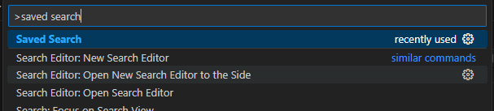
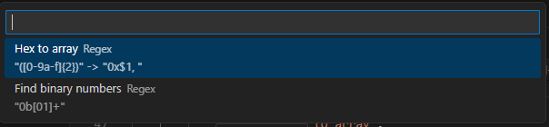
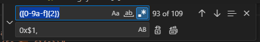
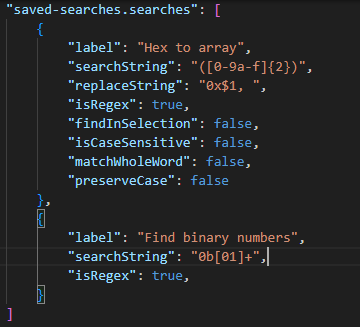

# saved-searches

Quickly retrieve search-and-replace values that you use often.

## Features

Press Ctrl+Shift+F or select the Saved Searches command in the command bar.

Choose the search you want.

Search away!

## Extension Settings

This extension contributes the following settings:

* `saved-searches.searches`: A list of saved searches to pick from.

## Known Issues

## Release Notes

### v0.0.1

Initial release
